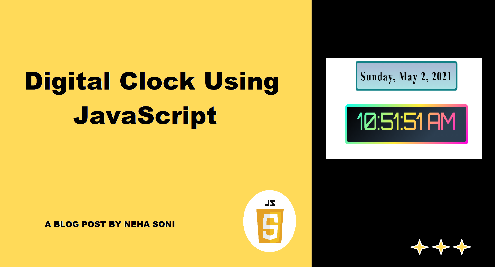

# Digital_Clock
A digital clock or watch in which the hours, minutes, and sometimes seconds are indicated by digits, as opposed to an analog clock, where the time is indicated by the positions of rotating hands. 

## Prerequisite
- Basic knowledge of HTML
- Basic knowledge of CSS
- Basic knowledge of JavaScript

## About the project
A digital clock or watch in which the hours, minutes, and sometimes seconds are indicated by digits, as opposed to an analog clock, where the time is indicated by the positions of rotating hands. You can find a step by step walkthrough in my Blog. Use the above linked image to navigate to my Blog.

## Some Snaps from the app

I would ❤ to connect with you at  <a href="https://twitter.com/nehasoni__">Twitter</a> | <a href="https://www.linkedin.com/in/neha-soni-70a6231b1/">LinkedIn</a>

 ### Show some ❤️ by starring some of the repositories!
